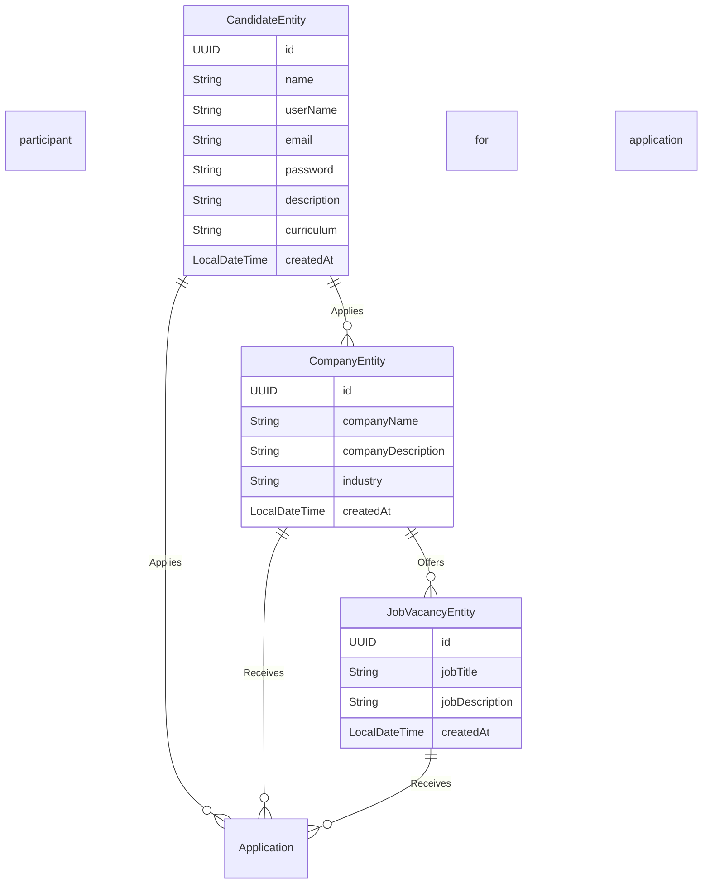

# Diagrama de classes

```mermaid
erDiagram
    participant CandidateEntity {
        UUID id
        String name
        String userName
        String email
        String password
        String description
        String curriculum
        LocalDateTime createdAt
    }

    participant CompanyEntity {
        UUID id
        String companyName
        String companyDescription
        String industry
        LocalDateTime createdAt
    }

    participant JobVacancyEntity {
        UUID id
        String jobTitle
        String jobDescription
        LocalDateTime createdAt
    }

    CandidateEntity ||--o{ CompanyEntity : Applies for
    CompanyEntity ||--o{ JobVacancyEntity : Offers
    CandidateEntity ||--o{ Application : Applies for
    CompanyEntity ||--o{ Application : Receives application
    JobVacancyEntity ||--o{ Application : Receives application
```
